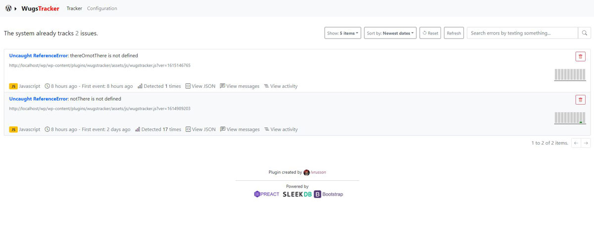

# Wugstracker

Is a wordpress plugin created for tracking javasctript and PHP errors. Is an experiment based on other commercial bugs tracker like "Sentry.io".

The plugin contians the following functionalities:

- Custom Rest API.
- Database storage with [SleekDB](https://sleekdb.github.io/).
- Admin area (Based on Preact & Bootstrap with no bundle).
    - Bug tracker page.
    - Options page.

---
## How to install

1. Download the zip from releases.

2. Unzip and upload the folder to ``/wp-content/plugins/`` folder via FTP or use the WP admin plugin installer.

3. Go to your site WP admin plugins page and activate.

4. Activate the options you want in the Wugstracker configuration page.

---

## TODO:

- Fix and improve PHP bug tracker.
- Improve JS tracker class and.
- Improve the tracker interface.
- Create a debug.log visualizer.
- Create a packaged version of the interface.

